# LatteConnect

MVP Android em Kotlin desenvolvido para a Sprint 3 da FIAP. O aplicativo simula uma plataforma de conexão entre nutrizes doadoras, bancos de leite humano, hospitais parceiros e famílias que precisam de doação.

## Identificação

| Informação | Descrição |
| --- | --- |
| Nome do projeto | LatteConnect |
| Nome da equipe | Latte Conect |
| Repositório GitHub | https://github.com/Felipetkr/Kotlin-sprint-3.git |
| Plataforma | Android nativo |
| Linguagem | Kotlin |
| Interface | Jetpack Compose + Material Design 3 |

| Integrante | RM |
| --- | --- |
| Felipe Dyundi Takara | 554751 |
| Lucas Campos Salles | 554789 |
| Vitor Amorim Vieira | 555288 |

## Objetivo do aplicativo

O LatteConnect busca reduzir a dificuldade de comunicação e engajamento na doação de leite humano. Para a Sprint 3, o foco do MVP é demonstrar um fluxo funcional e navegável, usando dados mockados, para cadastro de doadoras, solicitação de doação, busca de hospitais por CEP, visualização de unidade parceira e acompanhamento operacional básico.

## Funcionalidades implementadas

| Requisito funcional | Implementação no app |
| --- | --- |
| RF01 - Cadastro de doadora | Formulário com nome, telefone, e-mail, CEP, bairro, consentimento, horário mockado e confirmação visual. |
| RF02 - Solicitação de doação | Formulário para responsável, telefone, hospital de referência, CEP, perfil da solicitação e prioridade. |
| RF03 - Busca de hospitais parceiros | Campo de CEP, ordenação local de pontos mockados, mapa visual simulado e lista de unidades. |
| RF04 - Detalhe de unidade | Ao clicar em um hospital, o app abre a tela de detalhe usando o id da unidade como parâmetro de navegação. |
| RF05 - Painel operacional | Métricas mockadas de estoque, doadoras ativas, solicitações abertas, análises pendentes e cadastros recentes. |
| RF06 - Sobre o projeto | Tela com problema do pitch, priorização da Sprint 3, itens fora do escopo e perguntas frequentes. |

## Justificativa da priorização

A Sprint 3 pede um MVP Android funcional, sem backend, API, Firebase ou banco local. Por isso, foram priorizados os fluxos centrais previstos no roadmap do projeto: cadastro, página informativa e mapa simples com pontos de coleta por CEP. A IA consultiva, gamificação, notificações reais, dashboard analítico com mapa de calor e integrações externas ficam como evolução para a Sprint 4.

## Dados mockados

Os dados simulados ficam centralizados em:

`app/src/main/java/com/fiap/latteconnect/data/LatteMockData.kt`

O mock inclui:

- pontos de coleta com id, nome, tipo, bairro, endereço, CEP, distância, telefone, horário, estoque, prioridade, slots e observações;
- métricas de painel para estoque, doadoras, solicitações e análises;
- cadastros recentes de doadoras;
- perfis de solicitação de leite humano;
- estatísticas de impacto e perguntas frequentes.

Os modelos ficam em:

`app/src/main/java/com/fiap/latteconnect/model/`

## Estrutura do projeto

```text
app/src/main/java/com/fiap/latteconnect/
|-- data/          # Dados mockados organizados
|-- model/         # Classes de dados do domínio
|-- navigation/    # Rotas e NavGraph
|-- ui/components/ # Componentes reutilizáveis
|-- ui/screens/    # Telas principais do MVP
`-- ui/theme/      # Cores, tema e tipografia
```

## Principais telas

Cada tela abaixo tem 2 prints porque o conteúdo rola a página e não cabe inteiro em uma única captura.

### Home

Tela inicial com apresentação do produto e acesso aos fluxos principais.

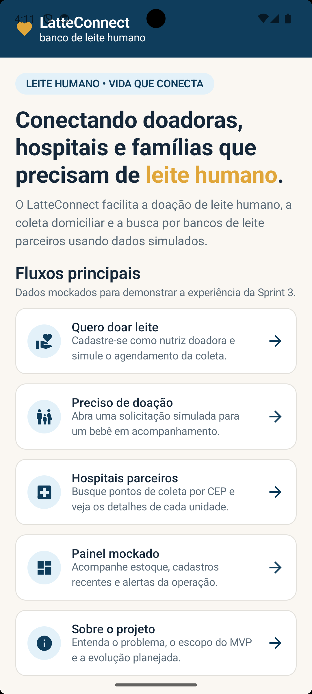
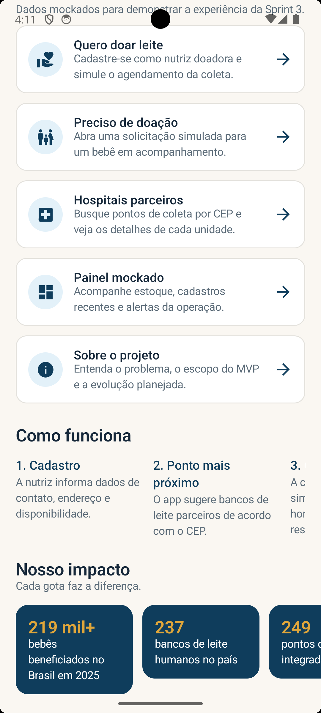

### Cadastro de doadora

Formulário simulado para nutriz doadora, com disponibilidade, consentimento e ponto de coleta sugerido.

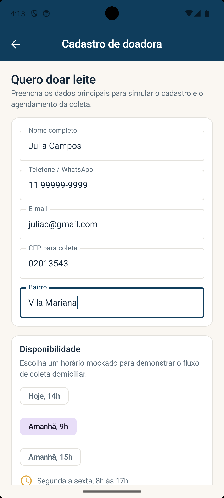
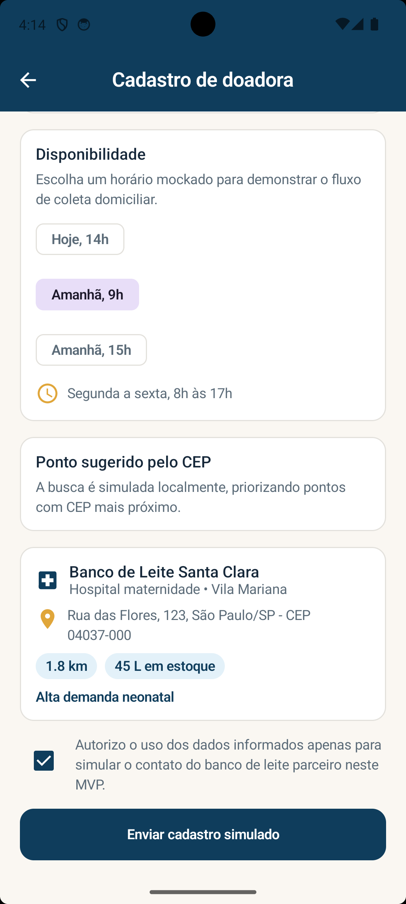

### Solicitação de doação

Fluxo mockado para famílias ou hospitais registrarem necessidade de leite humano.

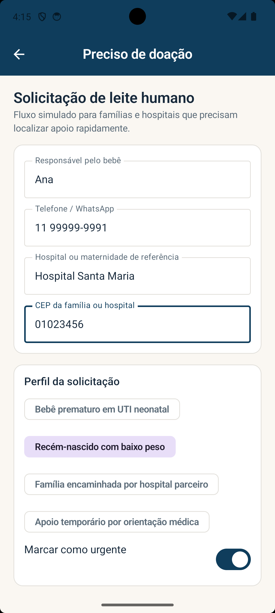
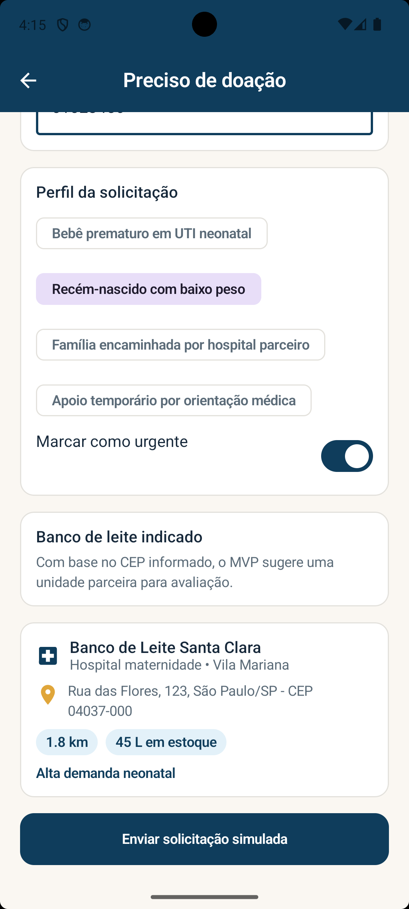

### Hospitais parceiros

Busca por CEP com mapa mockado e lista dinâmica de bancos de leite e hospitais parceiros.

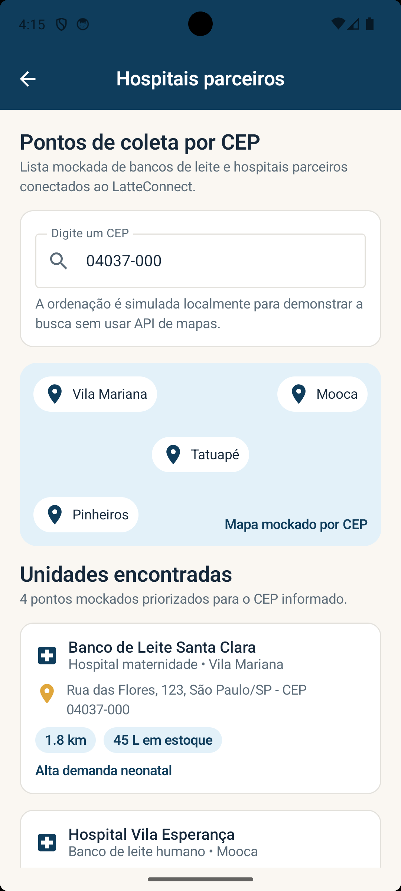
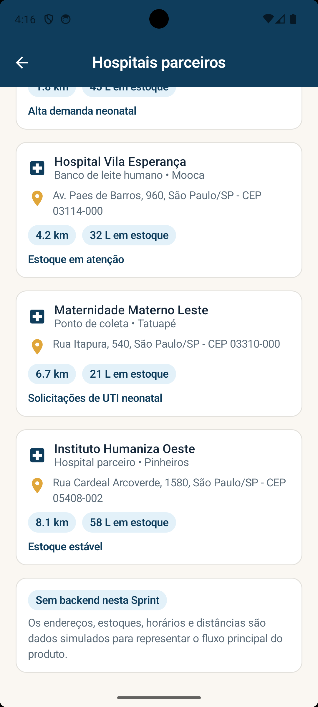

### Detalhe da unidade

Tela aberta a partir de um item da lista, usando passagem de parâmetro pelo id do ponto de coleta.

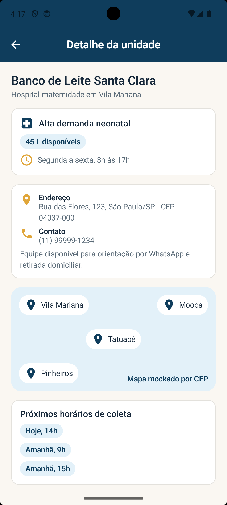
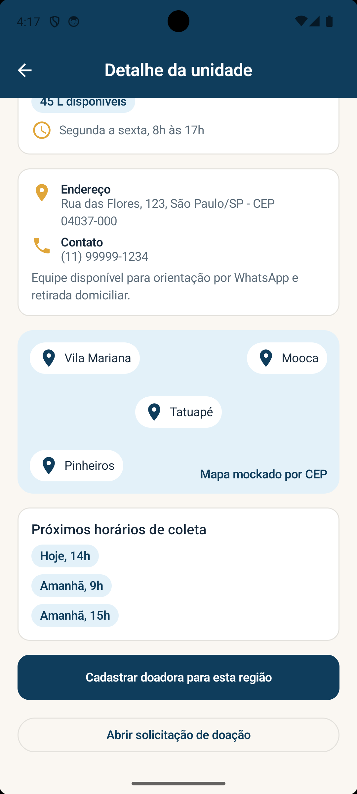

### Painel do MVP

Indicadores simulados para demonstrar o acompanhamento operacional da solução.

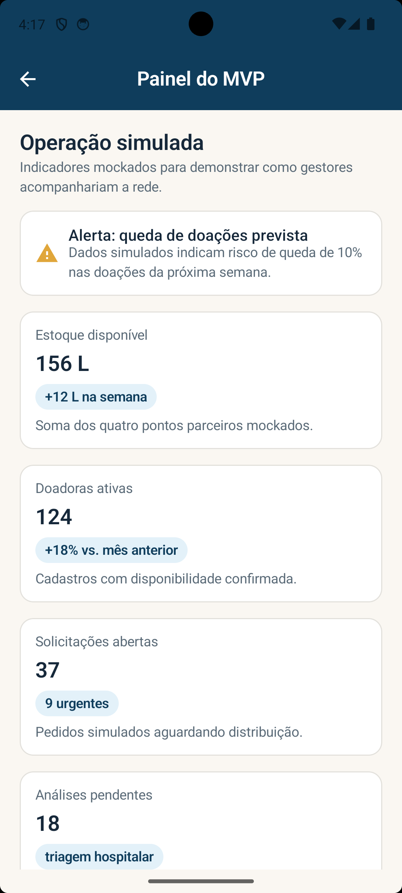
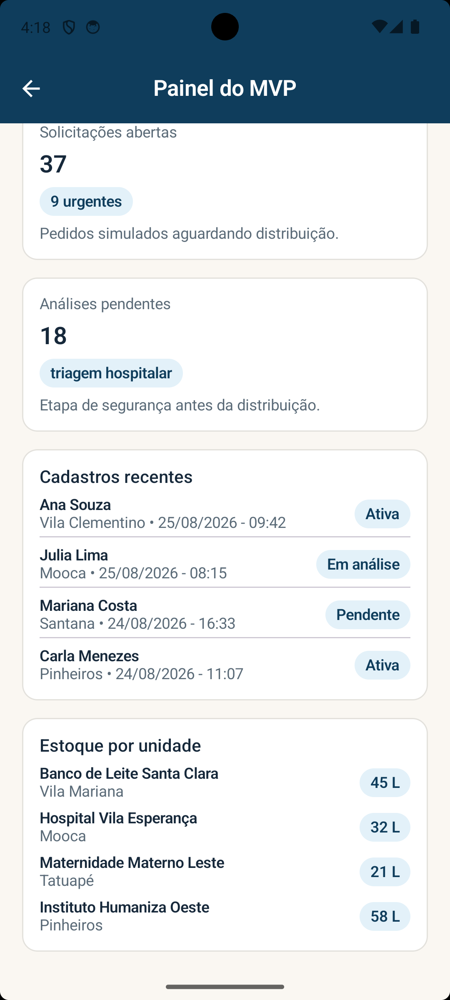

### Sobre o projeto

Resumo do problema, escopo priorizado, itens fora da Sprint 3 e perguntas frequentes.

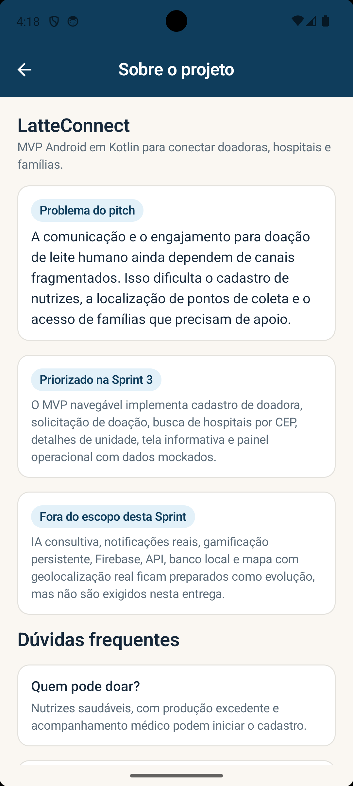
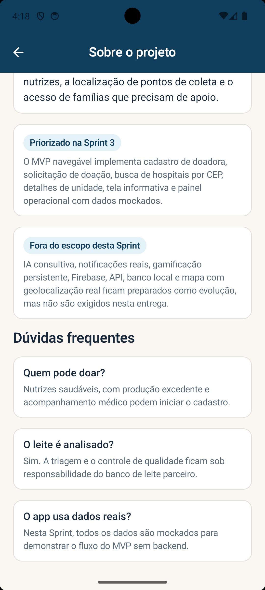

## Tecnologias utilizadas

- Kotlin 2.0.21
- Android Gradle Plugin 8.5.2
- Jetpack Compose
- Material Design 3
- Navigation Compose
- Android SDK 34
- minSdk 24
- targetSdk 34

## Como executar

1. Abra a pasta `LatteConnect` no Android Studio.
2. Aguarde o Gradle Sync.
3. Selecione um emulador ou dispositivo físico.
4. Clique em `Run`.

Também é possível compilar pelo terminal:

```bash
./gradlew :app:assembleDebug
```

Ao abrir o projeto pelo Android Studio, o arquivo `local.properties` é gerado com o caminho do Android SDK da máquina. Para compilar pelo terminal em uma pasta recém-extraída, configure o SDK por `ANDROID_HOME` ou crie esse arquivo com `sdk.dir=/caminho/para/seu/Android/sdk`.

Ambiente usado para validação nesta máquina:

- Android Studio 2025.3
- Build AI-253.32098.37.2534.15336583
- Emulador Pixel_6 com Android API 34

## Evidências de funcionamento

O app foi compilado com sucesso usando:

```bash
./gradlew :app:assembleDebug
```

O APK debug foi instalado e executado em um emulador Pixel_6. Os prints acima foram capturados do aplicativo rodando no emulador, não de Figma, slides ou protótipo estático.


## Observação sobre escopo técnico

Conforme a regra da Sprint 3, o projeto não usa API, Firebase, banco local ou backend. Todo o comportamento demonstrado é simulado com dados mockados organizados no código.
